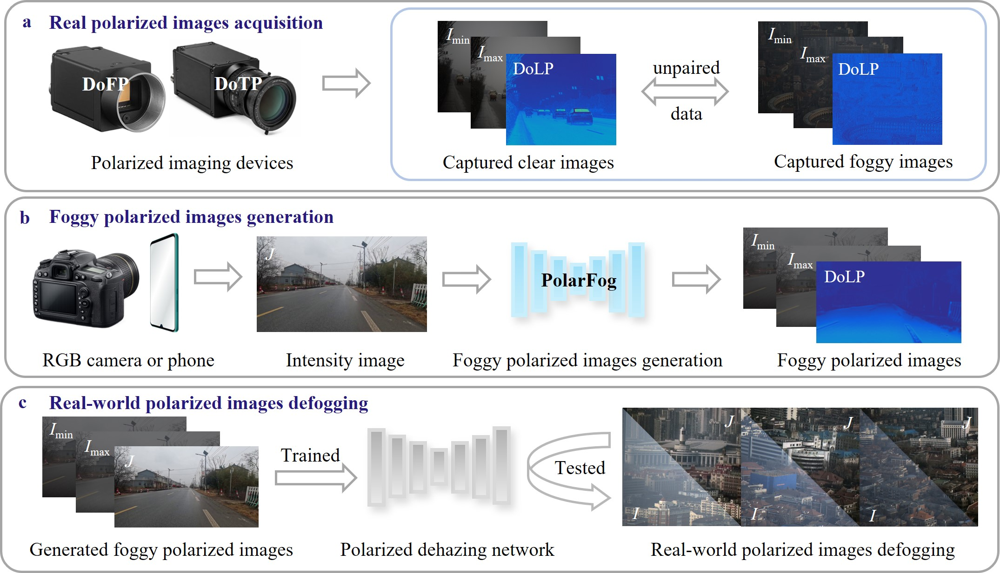

# PolarFog

<p align="center">
  <b>PolarFog: A Computational Imaging Framework for Controllable Foggy Polarization Image Generation</b>
</p>

<p align="center">
  <a href="#overview">Overview</a> |
  <a href="#dolp-video-demo">DoLP Demo</a> |
  <a href="#installation">Installation</a> |
  <a href="#inference">Inference</a> |
  <a href="#citation">Citation</a>
</p>

---

## Overview

**PolarFog** is a physics-informed computational imaging framework for controllable foggy polarization image generation from a single clear intensity image.

Polarization imaging provides useful information for vision and restoration tasks in foggy environments. However, acquiring strictly pixel-aligned clear and foggy polarization image pairs in real-world scenes is extremely difficult. PolarFog aims to alleviate this data bottleneck by generating foggy polarization-related images under controllable fog densities.

Given a clear intensity image, PolarFog can generate:

- foggy intensity image `I`
- maximum polarization image `Imax`
- minimum polarization image `Imin`
- degree of linear polarization image `DoLP`

The framework integrates physical polarization degradation modeling, depth-aware scene priors, fog-density modulation, and a one-step diffusion-based generation strategy.

---

## Framework

<p align="center">
  
</p>

PolarFog consists of two main components:

1. **Foggy intensity generation**  
   A one-step diffusion-based model generates foggy intensity images under specified fog-density conditions.

2. **Polarization information regression**  
   A depth-guided dual-branch network predicts a physically constrained polarization coefficient map, which is used to derive `Imax` and `Imin`.

The relationship between the generated polarization extrema and the foggy intensity image is constrained as:

```math
I_{\max} = \delta I, \quad I_{\min} = (1-\delta) I
