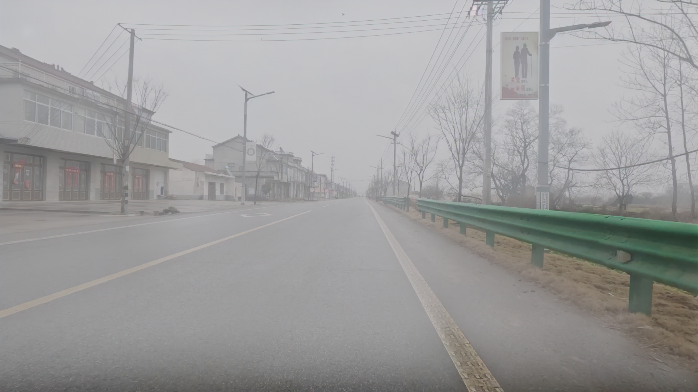

# PolarFog

  <b>PolarFog: A Computational Imaging Framework for Controllable Foggy Polarization Image Generation</b>

  <a href="#overview">Overview</a> |
  <a href="#dolp-video-demo">DoLP Demo</a> |
  <a href="#installation">Installation</a> |
  <a href="#inference">Inference</a> |
  <a href="#citation">Citation</a>

---

## Overview

**PolarFog** is a physics-informed computational imaging framework for controllable foggy polarization image generation from a single clear intensity image.

Polarization imaging provides useful information for vision and restoration tasks in foggy environments. However, acquiring strictly pixel-aligned clear and foggy polarization image pairs in real-world scenes is difficult. PolarFog aims to alleviate this data bottleneck by generating foggy polarization-related images under controllable fog densities.

Given a clear intensity image, PolarFog can generate:

- foggy intensity image `I`
- maximum polarization image `Imax`
- minimum polarization image `Imin`
- degree of linear polarization image `DoLP`
---
## DoLP Demo

The following demos show the clear input images, the generated foggy intensity images, and the corresponding DoLP results produced by the computational imaging framework PolarFog.

<table>
  <tr>
    <td align="center"><b>Clear Input Video</b></td>
    <td align="center"><b>Generated Foggy Intensity Video</b></td>
    <td align="center"><b>Generated DoLP Video</b></td>
  </tr>
  <tr>
    <td align="center">
      
    </td>
    <td align="center">
      
    </td>
    <td align="center">
      
    </td>
  </tr>
  <tr>
    <td align="center">
      <a href="https://github.com/polarhi/PolarFog/raw/main/assets/clear.mp4">View video</a>
    </td>
    <td align="center">
      <a href="https://github.com/polarhi/PolarFog/raw/main/assets/foggy_intensity.mp4">View video</a>
    </td>
    <td align="center">
      <a href="https://github.com/polarhi/PolarFog/raw/main/assets/dolp.mp4">View video</a>
    </td>
  </tr>
</table>
